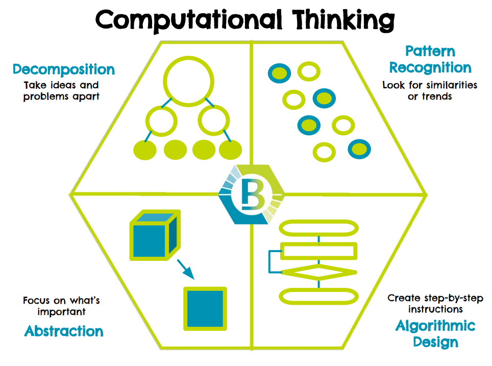

# Computational Thinking

*Computational Thinking* is an approach to problem solving with four key thinking processes:

1. Decomposition - taking ideas and problems apart
2. Pattern recognition - looking for similarities or trends
3. Abstraction- focusing on what’s most important
4. Algorithm design- creating step-by-step instructions to solve a problem